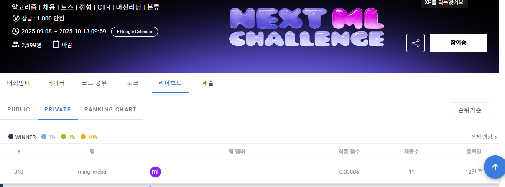

# 🧠 Toss CTR Click Prediction (Dacon)

> 개인 프로젝트 | 2025.09.28 ~ 2025.10.12  
> Dacon 주최 **Toss NEXT ML Challenge** 참가  
> **광고 클릭 예측(CTR)** 문제를 다루며, 실전 수준의 로그 데이터 분석 및 모델링 파이프라인 구축을 목표로 함.

---

## 🏁 Overview
토스는 ML 기술을 활용해 광고 퍼널의 전 과정을 최적화하고 있으며,  
이번 대회는 실제 토스 앱 내 광고 로그 데이터를 기반으로  
**“유저가 어떤 광고를 클릭할 확률을 예측하는 모델”**을 개발하는 것이 목표였다.  

본 프로젝트는 약 1천만 행의 로그 데이터를 활용해  
EDA → Feature Engineering → Modeling → Ensemble 과정을 개인적으로 수행한 결과물이다.

---

## 📦 Dataset
- **Train:** 10,704,179 rows / 119 columns  
- **Test:** 1,527,298 rows / 119 columns  
- **Target:** `clicked` (binary: 0 or 1)  
- **평가 지표:** Average Precision (AP), Weighted LogLoss (WLL)

**주요 컬럼 예시**
| Feature | Description |
|----------|--------------|
| gender, age_group | 사용자 인구통계 |
| inventory_id | 광고 지면 ID |
| day_of_week, hour | 시간/요일 정보 |
| seq | 사용자 로그 시퀀스 |
| history_a_*, history_b_* | 과거 인기도 기반 피처 |
| feat_a_* ~ feat_e_* | 익명화된 광고 속성 피처 |

---

## 🧩 Feature Engineering Highlights

CTR 예측은 단순 로그보다는 **사용자 행동 패턴과 광고 지면 특성의 조합**이 중요했다.  
아래는 최종 파이프라인에서 가장 성능에 기여한 주요 파생 변수들이다.

| 구분 | 변수명 | 설명 | 데이터 타입 | 인사이트 |
|:--:|:--|:--|:--|:--|
| 1️⃣ | **inventory_id** | 광고 지면 ID | categorical | CTR 편향이 뚜렷, feature importance 1위 |
| 2️⃣ | **history_a_1** | 최근 인기도 | numeric | 단기 행동 반영 (AP +0.0018) |
| 3️⃣ | **history_b_2** | 중기 인기도 | numeric | long-term 행동 반영 |
| 4️⃣ | **seq_length** | 세션 길이 | numeric | 짧은 세션일수록 CTR↑ |
| 5️⃣ | **diversity_ratio** | 세션 내 다양성 비율 | numeric | 다양성↑ → CTR 향상(AP +0.002) |
| 6️⃣ | **hour_dow_cross** | 시간×요일 교차 | categorical | user context 강화 |
| 7️⃣ | **age_gender_cross** | 연령×성별 교차 | categorical | demographic 반응차 반영 |
| 8️⃣ | **pca_component_1** | 주요 latent feature | numeric | 다중 상관 피처 압축 |
| 9️⃣ | **user_cluster** | 유저 군집 임베딩 | categorical | personalization 강화 |
| 🔟 | **inventory_id_hour_cross** | 지면×시간 교차 | categorical | 지면별 시간대 효과 반영 |

> `inventory_id`, `history_a_1`, `seq_length`는 전 모델 공통 상위 5위.  
> `diversity_ratio` 추가 시 Validation AP +0.002 향상.

---

## 📊 Results & Version Summary

| Ver | 모델 / 전략 | AP | WLL | Public LB | Rank | 비고 |
|---:|:--|:--:|:--:|:--:|:--:|:--|
| v1 | LGBM baseline (EDA1) | 0.05339 | 1.85859 | 0.19361 | 502 | 시작점 |
| v4 | LGBM+XGB (40:60) | 0.06871 | 0.76021 | 0.33832 | 271 | 첫 앙상블 |
| **v4.5** | **LGBM+XGB (45:55)** | **0.06933** | **0.61513** | **0.33912** | **270 → 313 (최종)** | **최종 제출 버전** |
| v8 | DCN (Deep & Cross Network) | 0.06527 | 0.63668 | 0.33702 | — | 딥러닝 단독 |
| v9 | LGBM (K-Fold) | 0.06920 | **0.58304** | 0.33870 | — | 단일모델 최고 안정 |
| v10 | 3-way Ensemble (LGBM+XGB+DCN, A) | 0.06915 | 0.59019 | 0.33884 | — | 앙상블 1 |
| v11 | 3-way Ensemble (LGBM+XGB+DCN, B) | 0.06916 | 0.59250 | 0.33896 | — | 비율 변경 버전 |
| v12 (내부비교) | 2-way Ensemble (LGBM+XGB) | 0.06915 | 0.59019 | — | — | v11 내부 비교, 미제출 |

> ✅ **최종 제출 모델:** v4.5 (LGBM + XGB 45:55)  
> Offline AP 0.06933 / WLL 0.61513 / Public LB **0.33912** / Rank 313  
> ※ Raw LB: 0.3391233623

---
### ⚖️ Ensemble Strategy
- 각 모델의 **out-of-fold prediction**을 `.npy`로 저장 후 weighted averaging 수행  
- 저장 경로 예시: `/local/ensemble_preds/lgbm_v4.npy`, `/local/ensemble_preds/xgb_v4.npy`  
- 최종 비율: **LGBM 45% / XGB 55%**  
- Weight는 Validation AP 기준으로 grid search를 통해 결정, 각 k-fold 적용 모델 생성 시 함께 생성한 npy파일 기준함.
- DCN은 feature expressiveness 향상 목적으로 최종 버전에서 추가함. 미미한 효과를 보임.
---

## 🏆 Leaderboard

최종 Public Leaderboard 결과:

| Version | Public Score | Rank |
|:--:|:--:|:--:|
| **v4.5** | **0.33912** | **313th** |



---

## ⚙️ Technical Stack
- **Language:** Python 3.11.9  
- **Libraries:** pandas 2.3.2, numpy 2.3.3, scikit-learn 1.7.2, scipy 1.16.2, wandb 0.22.0  
- **Additional Tools:** GitPython, pydantic, python-dotenv  
- **Environment:** Local Jupyter Notebook (Windows 10, Samsung Laptop) + **NVIDIA GeForce RTX 3090 (24GB VRAM)**  
- **Virtual Env:** conda (ml_project)  
- **Version Control:** GitHub (manual notebook iteration tracking, v1–v12)

---

## 📁 Repository Structure
```
toss_ctr_dacon_project/
│
├─ 📄 README.md                     # 프로젝트 개요, 성과, 리더보드 이미지 포함
├─ 📄 .gitignore                    # 데이터, npy 등 제외 설정
├─ 📄 environment.yml               # (선택 사항, 있으면 완성도↑)
│
├─ 📂 notebooks/
│  ├─ 1_EDA_Preprocessing/
│  │   ├─ EDA_v1.ipynb
│  │   ├─ EDA_v2.ipynb              # ✅ 최종 전처리 버전
│  │   └─ EDA_v3.ipynb
│  │
│  ├─ 2_Feature_Engineering/
│  │   ├─ FE_v1.ipynb
│  │   └─ FE_v2.ipynb               # ✅ 최종 피처엔지니어링 버전
│  │
│  └─ 3_Modeling/
│      ├─ Modeling_v1.ipynb
│      ├─ Modeling_v2.ipynb
│      ├─ Modeling_v3.ipynb
│      ├─ Modeling_v4.ipynb
│      ├─ Modeling_v4.5.ipynb       # ✅ 최종 제출 (LGBM+XGB 45:55)
│      ├─ Modeling_v5.ipynb
│      ├─ Modeling_v6.ipynb
│      ├─ Modeling_v7.ipynb
│      ├─ Modeling_v8.ipynb
│      ├─ Modeling_v9.ipynb
│      ├─ Modeling_v10.ipynb
│      └─ Modeling_v11.ipynb
│
└─ 📂 assets/
    └─ toss_dacon_rank.PNG          # Public Leaderboard 스크린샷

```

---

## 🧭 Limitations & Learnings

### 😞 아쉬웠던 점
- **컴퓨팅 리소스 부족:**  
  GPU 자원이 제한되어 raw data를 그대로 학습시킨 참가자들보다 실험 속도와 범위가 좁았다.  
- **시간 제약:**  
  MLOps 팀 프로젝트 병행으로 실질적으로 대회 후반부에만 집중할 수 있었다.  
- **경험 부족:**  
  CTR 모델링에 딥러닝이 적합하다는 걸 알고 있었지만, DCN 외에 다양한 구조를 시도하지 못했다.  

### 🌱 얻은 점
- **대규모 로그 데이터 처리 경험:**  
  데이터 전처리부터 Feature Engineering, 모델링, 앙상블까지 전 과정을 단독 수행.  
- **Feature Engineering의 중요성 실감:**  
  Sequence 기반 피처(`seq_length`, `diversity_ratio`)가 모델 성능 향상에 직접 기여함을 검증.  
- **실험 버전 관리 역량 향상:**  
  v1~v12 실험 이력을 체계적으로 관리하며 reproducibility의 중요성을 체득.  
- **모델간 Trade-off 이해:**  
  LGBM, XGB, DCN의 장단점을 비교 분석하며 실무형 판단 기준 확보.

---

## 🚀 Next Steps
- CTR task에 특화된 Deep CTR 모델(DIN, DCN-v2, AutoInt 등) 시도 예정  
- Feature Embedding Layer 고도화 및 Feature Interaction 자동화 실험  
- MLflow 기반 실험 관리 및 모델 버전 추적 적용

---

> _본 리포지토리는 Toss NEXT ML Challenge 참가 경험을 바탕으로, CTR 예측 문제의 전 과정을 독립적으로 수행한 기록입니다._
